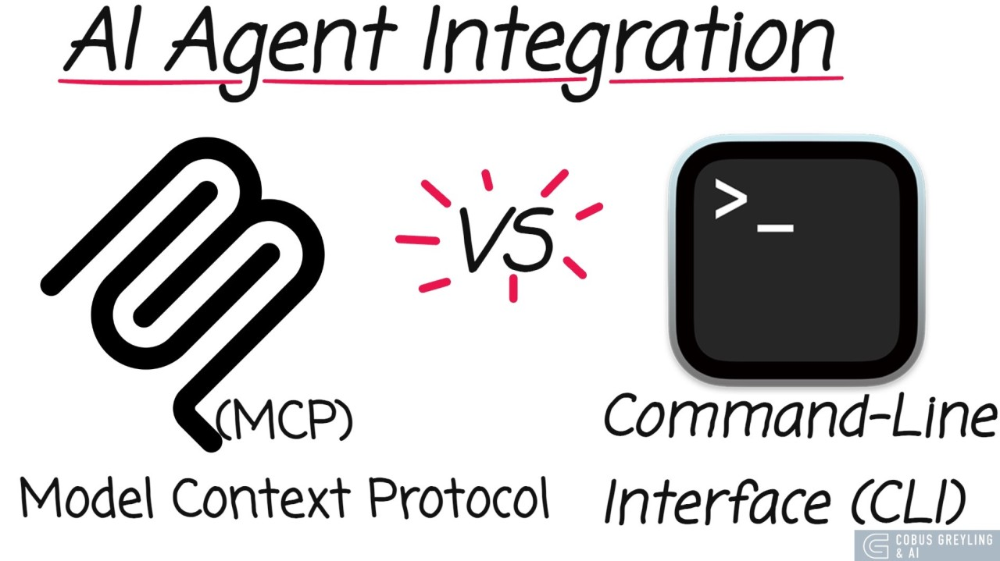

# Token Economy: How to Spend an AI Coding Budget Like an Engineer

*Artsiom Hontar · September 20, 2026*

## Abstract

Coding-agent cost is often discussed as if it were a property of the model alone.

In practice, the bill is produced by a system: model, harness, tools, context, cache behavior, retries, and human intervention.

This article presents a practical framework for reducing that system cost without turning token minimization into the goal.

The objective is better measured as **verified work per dollar**.

The evidence combines public benchmark results, published tooling evaluations, and observations from high-volume day-to-day agent use.

The main conclusions are straightforward:

1. Model choice should follow task complexity and failure cost, not model prestige.
2. Harness choice can change cost materially even when success rates remain close.
3. Context should be isolated, compressed, and kept below the point where retrieval quality degrades.
4. Prompt caching is an operational discipline, not a feature that can be enabled once and forgotten.
5. The useful unit of measurement is a closed and verified task, pull request, or incident outcome.

This is a field guide rather than a new benchmark.

Where a number comes from an external benchmark, the source is named.

Where a number comes from a local capture or personal workflow, it is labeled as such.

## Evidence base

This article is a synthesis of public benchmark results, open-source tooling evaluations, and operational observations from a high-volume coding-agent workflow.

It does not claim that one tool or harness wins every workload.

| Source | Evidence used here | Status |
|---|---|---|
| HarnessTax | Matched model-harness comparisons on SWE-bench Lite and Terminal-Bench 2.0 | Public benchmark |
| DeepSWE | Cost-aware model and reasoning-effort comparison for software-engineering tasks | Public benchmark |
| gh-axi | CLI-versus-MCP GitHub task comparison | Public evaluation |
| Headroom | Wire-layer compression methods and evaluation results | Open-source project |
| RTK | Shell-output compression and savings history | Local workflow capture |
| Token Economy deck | Context, cache, attribution, and operating recommendations | Practitioner synthesis |

The external studies use different task sets, evaluators, pricing assumptions, and execution environments.

Their numbers should therefore be read as evidence for mechanisms and trade-offs, not as a single shared leaderboard.

## The unit of optimization is a closed task

An agent can consume fewer tokens and still be more expensive if it requires more retries, more review, or more human recovery.

The useful denominator is not tokens.

It is a verified result.

```text
cost per closed task = total agent cost / successfully verified tasks
```

For pull-request work, the same idea becomes:

```text
cost per accepted PR = total agent cost / PRs accepted after human review
```

This changes the questions we ask.

Instead of asking which model is cheapest, ask which model and operating setup closes this class of task at the lowest reliable cost.

Instead of asking whether a context window is large, ask whether the agent can still retrieve the relevant fact after the context has grown.

Instead of asking whether a tool integration is convenient, ask how much context it adds on every turn and whether it improves the outcome enough to justify that cost.

## Finding 1: Route by task, not by habit

The expensive mistake is not always choosing an expensive model.

It is choosing a model without considering the cost of failure.

A cheap model is often the correct choice for mechanical edits, formatting, triage, and well-bounded transformations.

A mid-tier model is usually the right default for specified feature work, tests, and routine pull requests.

A frontier model earns its cost when the task is genuinely ambiguous, the blast radius is high, or repeated attempts on a lower tier have stopped producing new information.

The practical routing rule is:

1. Start with the least expensive model that can plausibly solve the task.
2. Escalate after repeated failures or a clear reasoning bottleneck.
3. Once the hard plan exists, de-escalate the mechanical execution when possible.
4. Stop multiplying turns when the agent is repeating the same failed strategy.

This is not an argument for always using the cheapest model.

It is an argument for paying for capability when capability is the bottleneck.

## Finding 2: The harness is part of the model choice

A coding agent is not just a model behind a chat interface.

The harness controls the loop, tools, system instructions, context construction, retries, and stopping behavior.

That means a model evaluation that ignores the harness is incomplete.

HarnessTax evaluates 21 model-harness pairs across seven models and three harnesses: Claude Code, Codex CLI, and Pi.

The study uses the same 30 tasks from SWE-bench Lite and Terminal-Bench 2.0, with three runs per task and official benchmark evaluators.

Its most important result is not a universal winner.

It is the size of the cost difference for similar success rates.

On SWE-bench Lite, Claude Code costs about 2.0 times as much as Pi across shared models while the average harness effect on success stays within roughly plus or minus 2 percent.

On Terminal-Bench 2.0, Claude Code costs about 1.5 times as much as Pi while the average success-rate effect stays within roughly plus or minus 5 percent.

The same study finds that an alternative harness has the highest observed success rate in nine of twelve comparisons across the Anthropic and OpenAI models it examines.

The conclusion is not that Pi should replace every other harness.

The conclusion is that the model-harness pair should be measured together.

A default harness can create a hidden **harness tax** before the task has produced any useful work.


## Finding 3: Initial context is already part of the bill

A harness can spend tokens before the first meaningful tool call.

HarnessTax reports that Claude Code's average initial context on SWE-bench Lite is more than ten times Pi's across the evaluated models.

That context includes instructions, tool schemas, and the task prompt.

Some of that overhead may buy useful behavior.

Some of it may be redundant for a specific workload.

The only reliable way to know the difference is to measure it against task success and cost.

This is why context engineering belongs near the beginning of an agent architecture, not at the end of a cost dashboard.

## Finding 4: Reduce at the interface boundary

The cheapest token is the token that never enters the model context.

This principle applies at several boundaries.

### Prefer narrow interfaces when they carry less state

In the gh-axi CLI-versus-MCP benchmark, the agent-tuned CLI completed the evaluated GitHub tasks with 46,462 input tokens, three turns, and a 100 percent success rate.

The same table reports 137,409 to 175,757 input tokens for the evaluated GitHub MCP configurations, with more turns and lower success rates in that test.



This does not prove that every CLI is better than every MCP server.

It does show the mechanism clearly: eager tool schemas and broad integration surfaces can be charged on every turn, including turns that never use the tool.

A narrow CLI or on-demand tool search can keep the interface closer to the actual task.

### Package repeated knowledge as a Skill

Skills are a useful middle layer between a long permanent prompt and an always-on tool server.

They keep the pointer available while loading the full procedure only when a task matches.

This works well for file formats, code-review standards, release runbooks, incident procedures, and repository conventions.

The design rule is simple:

```text
load the pointer broadly; load the procedure narrowly
```

### Compress output before it reaches the model

Shell output, logs, JSON, stack traces, and search results often contain repetition that is useful to a human but wasteful in a model context.

RTK and Headroom are examples of tools that attack this cost at different layers.

RTK rewrites noisy shell output before it reaches the agent.

Headroom applies structural deduplication, re-encoding, salience-aware truncation, and semantic chunking to tool output and retrieved context.


The safe version of compression is not arbitrary summarization.

It preserves the information required for the next decision and removes repeated structure around it.

## Finding 5: More context is not automatically better context

A large context window removes one hard limit.

It does not remove retrieval degradation, attention dilution, or the cost of carrying irrelevant history forward.

The practical pattern is to isolate exploration.

A subagent can read many files, run commands, and fail a few times without forcing all of that intermediate noise into the parent context.

The parent should receive the decision-relevant result, not the full transcript of exploration.

Long-context retrieval benchmarks also make the trade-off visible.

In the MRCR v2 results shown in the deck, even a frontier model loses retrieval accuracy as the input grows from hundreds of thousands of tokens toward one million.

The operating rule is therefore:

1. Keep the active working context bounded.
2. Move broad exploration into isolated subagents or short-lived workers.
3. Summarize decisions and evidence, not every command.
4. Start a clean context when the current one becomes a liability.

For many coding tasks, a smaller, curated context is more useful than the largest available window.

## Finding 6: Prompt caching is an operating discipline

Prompt caching can make repeated context much cheaper.

It can also be defeated by normal workflow behavior.

Switching providers or models mid-session often rebuilds the cached prefix.

Letting a task sit beyond the provider's time-to-live window can force another cache write.

Changing the system prompt or tool configuration can invalidate the prefix even when the repository has not changed.

The practical rules are:

1. Keep related turns on one provider and model when possible.
2. Batch related work inside the cache time-to-live window.
3. Keep stable instructions and tool configuration stable.
4. Treat a provider switch as a cache reset in the cost model.

The exact prices and time-to-live values change.

The operational principle does not.

Cache value comes from stable prefixes and close reuse.


## Finding 7: Observe drift, not just spend

A monthly invoice is too late to diagnose an agent loop.

The useful signals are visible during the session:

- Context occupancy and growth rate.
- Cache-read ratio.
- Tokens and cost per minute.
- Repeated tool calls.
- Repeated file reads.
- Failed commands that recur without a strategy change.
- Human interventions and recovery actions.

A rising burn rate is often a symptom of exploration that has stopped producing information.

Three failed attempts with the same approach should trigger a new strategy, not a fourth prompt that restates the same request.

Observability should connect session cost to the outcome that justified it.

For engineering work, useful attribution keys include repository, branch, pull request, issue, task type, model, harness, and human review time.

The tooling is still immature.

The measurement model is not.

## A practical operating model

The following loop is small enough to use every day.

### Step 1: Define the result

Write down what counts as done before the agent starts.

For a code change, that may include tests, review criteria, and a behavior-level acceptance check.

For an incident, it may include mitigation, root-cause evidence, and a rollback plan.

### Step 2: Choose the model and harness together

Select the least expensive pair that can plausibly satisfy the result.

Do not assume a provider's default harness is the cheapest or most effective pairing for every workload.

### Step 3: Reduce the interface

Prefer narrow commands, focused search, on-demand skills, and compressed output.

Avoid loading every available tool schema into every turn unless the task truly needs that surface.

### Step 4: Isolate exploration

Delegate broad repository discovery, independent research, and noisy experiments into separate contexts.

Return a compact result with evidence and unresolved questions.

### Step 5: Protect the cache

Keep stable work together and avoid unnecessary provider or system-prompt changes mid-task.

### Step 6: Intervene on drift

Watch for repeated actions, escalating context, and rising cost without new evidence.

Change the strategy or take the task back before the loop compounds.

### Step 7: Attribute the result

Record the cost against the task, branch, pull request, or incident that consumed it.

Without attribution, optimization becomes a collection of anecdotes.

## What to measure

A lightweight scorecard can be built from five measures.

| Measure | Definition | Why it matters |
|---|---|---|
| Success rate | Verified tasks completed correctly | Prevents cost reduction from hiding quality loss |
| Cost per closed task | Total agent cost divided by verified successes | Measures the actual economic unit |
| Retry rate | Attempts that repeat a failed strategy | Exposes weak routing and runaway loops |
| Context burn rate | Context tokens consumed per unit of useful progress | Shows when history is becoming overhead |
| Human recovery time | Time spent correcting or re-running agent work | Captures costs missing from the API invoice |

The best setup is not the one that wins one metric in isolation.

It is the setup that stays near the efficient frontier across quality, cost, latency, and review burden.

## What this does not mean

It does not mean that simple harnesses are always better.

Richer harness features may help on workloads that were not included in the public comparisons.

It does not mean that MCP is always a bad choice.

An MCP server can be the right interface when discoverability, permissions, or structured resources are more important than eager schema cost.

It does not mean that token count is the only cost.

Wall-clock time, failure recovery, human review, infrastructure, and operational risk also belong in the decision.

It does not mean that benchmark results transfer automatically to production repositories.

SWE-bench Lite, Terminal-Bench 2.0, DeepSWE, and gh-axi measure useful slices of the problem.

Real work includes evolving requirements, private code, developer feedback, partial knowledge, and tasks that span sessions.

The responsible conclusion is to use public evidence to choose what to measure next in your own workflow.

## Conclusion

AI coding cost is a systems property.

The model matters, but so do the harness, tools, context, cache, loop, and stopping rule around it.

The strongest practical strategy is not to minimize tokens blindly.

It is to spend tokens where they increase the probability of a verified result and remove them where they only carry repetition, stale history, or unused capability.

Choose the model and harness as a pair.

Measure cost per closed task.

Compress before context.

Isolate exploration.

Protect stable prefixes.

Intervene when the agent stops producing new information.

That is the core of a token economy: not fewer tokens at any cost, but more verified engineering output per dollar.

## Sources and further reading

1. HarnessTax, “How Much Does the Harness Matter for Coding Agents?”, https://harnesstax.github.io/
2. DeepSWE, https://deepswe.datacurve.ai/
3. gh-axi, https://github.com/kunchenguid/gh-axi
4. Headroom, https://github.com/headroomlabs-ai/headroom
5. RTK, https://github.com/rtk-ai/rtk
6. Microsoft Coreutils for Windows, https://github.com/microsoft/coreutils
7. ripgrep, https://github.com/BurntSushi/ripgrep
8. Langfuse, https://langfuse.com
9. Helicone, https://helicone.ai
10. SWE-bench Lite, https://www.swebench.com/lite
11. Terminal-Bench, https://github.com/laude-institute/terminal-bench
