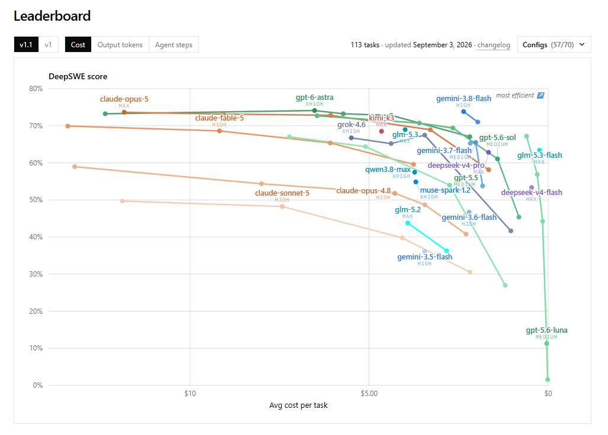
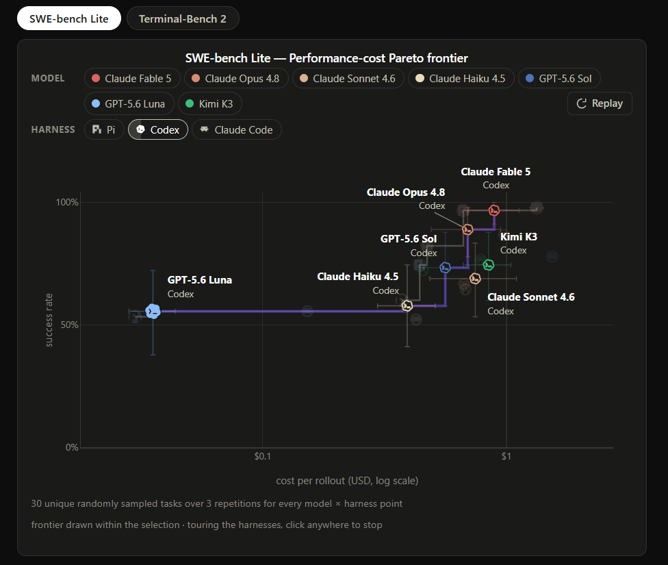
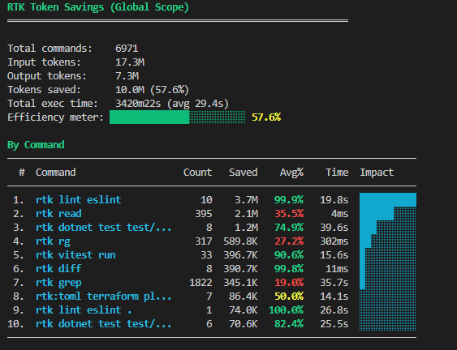
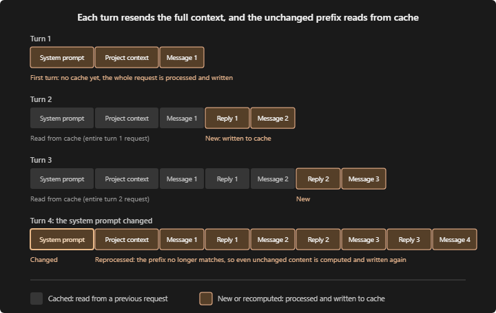

# Token Economy: Spend Tokens like an AI Engineer

*Artsiom Hontar · September 20, 2026*

## Abstract

AI coding cost is not a model property.
It is a systems property created by the model, harness, tools, context, cache, retries, and human decisions around the task.

The practical target is **verified engineering output per dollar**.
This article turns the Token Economy presentation into an operating guide for choosing a model, controlling context, and stopping wasteful agent loops before they become expensive.

## TL;DR

Use three model tiers instead of one permanent default:

1. **Cheap** for mechanical edits, formatting, triage, and predictable transformations.
2. **Medium** for most implementation work, tests, and routine pull requests.
3. **Frontier** for ambiguous architecture, difficult debugging, and high-blast-radius decisions.

Choose the model and harness together.
Keep tool interfaces narrow, load Skills and tool schemas on demand, compress command output before it enters context, and keep related work inside the cache window.
Measure cost per closed task, not tokens in isolation.
When the agent repeats a failed strategy, change the strategy or take the task back.

## The unit: a verified task

An agent can use fewer tokens and still cost more if it needs retries, review, or human recovery.
The useful unit is a closed task with a verified result.

```text
cost per closed task = total agent cost / successfully verified tasks
```

For a pull request, include the work that happens after the model stops:

```text
cost per accepted PR = agent cost + human recovery cost / accepted PRs
```

This changes the question from "Which model is cheapest?" to "Which setup closes this type of work reliably at the lowest total cost?"

## Finding 1: Route work through three model tiers

The most useful model decision is not a leaderboard ranking.
It is a routing decision made before the task starts.

### Cheap: predictable work

Use the cheap tier for mechanical edits, formatting, renaming, simple migrations, issue triage, changelog updates, and transformations with an obvious acceptance check.
Examples include renaming a field across many files, converting a configuration format, or classifying a queue of GitHub issues.

Typical examples are Claude Haiku or GPT-5.6 Luna at high reasoning.
The model does not need to invent the design; it needs to execute a bounded operation without wasting context.

### Medium: the default implementation tier

Use the medium tier for well-specified features, tests, bug fixes with a known direction, routine pull requests, and most day-to-day engineering.
This is the tier that should carry the largest share of normal work because it balances capability, cost, and speed.

Typical examples are Claude Sonnet or GPT-5.6 Terra.
Start here when the task has a clear result but still requires repository navigation, implementation choices, and verification.

### Frontier: buy judgment only when judgment is the bottleneck

Use the frontier tier for ambiguous architecture, production incidents with no clear cause, risky migrations, difficult debugging, and decisions with a large blast radius.
Do not use it for work that the cheap tier can finish in seconds.

Typical examples are Claude Opus or Fable and GPT-5.6 Sol.
Once the frontier model has produced a sound plan, move mechanical execution back to the medium or cheap tier when the handoff is safe.

The routing loop is simple:

1. Start with the cheapest tier that can plausibly close the task.
2. Escalate one tier after repeated failures or a real reasoning bottleneck.
3. Do not spend three more turns repeating the same failed approach.
4. De-escalate after the hard decision is made.

The DeepSWE benchmark makes the economic shape visible.
Its leaderboard plots score against average cost per task across 113 tasks, 91 repositories, five languages, and 57 model/reasoning configurations.
The useful point is not the highest dot; it is the knee where more spend stops buying meaningful task completion.



The benchmark is designed around contamination-free tasks and behavioral verification.
That makes it useful for comparing cost and effectiveness, but it still does not choose your model for you.
Use the chart to identify candidates, then validate the routing rule on your own repositories and task mix.

## Finding 2: Benchmark the model and harness as one system

A coding agent is not just a model behind a chat box.
The harness controls the system prompt, tool schemas, context construction, retries, stopping behavior, and the amount of work that happens before the first useful tool call.

HarnessTax compared 21 model-harness pairs across seven models and three harnesses: Claude Code, Codex CLI, and Pi.
It used the same 30 tasks from SWE-bench Lite and Terminal-Bench 2.0, with three runs per task and official evaluators.

On SWE-bench Lite, Claude Code cost about 2.0 times as much as Pi across shared models while the average harness effect on success stayed within roughly plus or minus 2 percent.
On Terminal-Bench 2.0, Claude Code cost about 1.5 times as much as Pi while the average success-rate effect stayed within roughly plus or minus 5 percent.
The same study found an alternative harness had the highest observed success rate in nine of twelve comparisons across the Anthropic and OpenAI models it examined.



The practical conclusion is not "always use Pi."
It is "measure the pair."
Keep the model fixed, change the harness, and compare cost per verified task, initial context, turns, retries, and success.
A default harness can create a hidden tax before the task has produced useful work.

## Finding 3: Pay for the interface only when you use it

The cheapest token is the token that never enters context.
Tool integrations are part of the bill because their schemas, help text, and output are carried through the agent loop.

In the gh-axi comparison, an agent-tuned CLI completed the evaluated GitHub tasks with 46,462 input tokens, three turns, and 100 percent success.
The evaluated GitHub MCP configurations used 137,409 to 175,757 input tokens, more turns, and lower success in that test.

| Interface | Input tokens | Cost per task | Turns | Success |
|---|---:|---:|---:|---:|
| gh-axi, agent-tuned CLI | 46,462 | $0.050 | 3 | 100% |
| gh CLI, raw | 47,076 | $0.054 | 3 | 86% |
| GitHub MCP, code execution | 137,409 | $0.101 | 7 | 84% |
| GitHub MCP + ToolSearch | 153,621 | $0.147 | 8 | 82% |
| GitHub MCP, eager schemas | 175,757 | $0.148 | 6 | 87% |

This does not make every CLI better than every MCP server.
It shows the mechanism: eager schemas can be charged on every turn, including turns that never use the tool.
Use a narrow CLI, on-demand ToolSearch, or a tightly scoped MCP server when the task does not need a broad integration surface.

## Finding 4: Load knowledge on demand

Skills are a useful middle layer between a huge permanent prompt and an always-on tool server.
Keep a short pointer available, then load the full procedure only when the task matches.

This works for file formats, code-review standards, release runbooks, incident procedures, repository conventions, and other knowledge that is complex but not needed on every turn.

```text
load the pointer broadly; load the procedure narrowly
```

ToolSearch applies the same idea to MCP.
Instead of loading every schema up front, the agent searches an index and pulls in only the schema it needs.
That can reduce eager-load overhead, although the benchmark still showed a larger context surface than the tuned CLI.

Context engineering is the next boundary.
Isolate broad exploration in a subagent or short-lived worker, then return the decision and evidence rather than the full transcript.
Start a clean context when the current one has become a liability.

## Finding 5: Compress before output reaches the model

Shell output, logs, JSON, stack traces, and search results often contain repetition that is useful to a human but expensive for a model.
Compress at the interface boundary instead of asking the model to summarize the same noise after it has already entered context.

RTK rewrites noisy shell output from Git, test runners, package managers, and Kubernetes into a leaner equivalent before the agent sees it.
In one local capture, 6,971 commands saved 10.0 million tokens, or 57.6 percent of input, across 17.3 million input and 7.3 million output tokens.
The largest savings came from repetitive commands such as lint, diff, and test output.



Headroom attacks the same problem at the wire layer with structural deduplication, re-encoding, salience-aware truncation, and semantic chunking.
The safe version of compression preserves the information required for the next decision and removes repeated structure around it.
Do not summarize away the error line, the failing assertion, or the file and line that the next action depends on.

## Finding 6: Protect stable prompt prefixes

Prompt caching makes repeated context much cheaper, but normal workflow changes can destroy the benefit.
Switching providers or models can rebuild the prefix.
Changing the system prompt or tool configuration can invalidate it.
Letting a task sit beyond the provider time-to-live can force another write.

Use these operating rules:

1. Keep related turns on one provider and model when possible.
2. Batch related work inside the cache time-to-live window.
3. Keep stable instructions and tool configuration stable.
4. Treat a provider switch as a cache reset in the cost model.

Cache reads are often about 10 times cheaper than fresh input.
A write premium of 1.25 to 2 times pays for itself after one reuse, but only if the prefix stays stable long enough to be read again.



## Finding 7: Watch drift while the task is running

A monthly invoice is too late to diagnose an agent loop.
Watch the session itself:

- Context occupancy and growth rate.
- Cache-read ratio.
- Tokens and cost per minute.
- Repeated tool calls and repeated file reads.
- Failed commands that recur without a strategy change.
- Human interventions and recovery actions.

Three failed attempts with the same approach should trigger a new strategy, not a fourth prompt that restates the request.
Use `/compact`, checkpoint the work, split the task, or take the next decision yourself.

For attribution, tag sessions with repository, branch, pull request, issue, task type, model, harness, and human review time.
Session cost tells you what happened.
Git and PR metadata tell you why the work was worth doing.

## Finding 8: Keep humans on the decisions that matter

AI and human work are not a competition.
They are a budget allocation problem.

Humans should own problem framing, architecture constraints, risk tolerance, and final review.
Agents should carry implementation, repetitive transformations, test generation, search, and other work with a clear verification loop.

The more ambiguous or irreversible the decision, the more human judgment belongs in the loop.
The more mechanical and testable the operation, the more useful delegation becomes.
Do not confuse an unsupervised loop with an autonomous system; it may only be an expensive loop with no owner.

## A practical operating model

Use this loop for a real task:

### 1. Define the result

Write down what counts as done before the agent starts.
For code, include tests, review criteria, and a behavior-level acceptance check.
For an incident, include mitigation, root-cause evidence, and a rollback plan.

### 2. Pick the tier and harness

Choose the cheapest model-harness pair that can plausibly close the result.
Record the choice so a later comparison has a baseline.

### 3. Reduce the interface

Use focused search, narrow commands, on-demand Skills, ToolSearch, and compressed output.
Do not load every tool schema or every repository document by default.

### 4. Isolate exploration

Let a subagent or short-lived worker handle broad discovery and noisy experiments.
Return decisions, evidence, and unresolved questions to the main task.

### 5. Protect the cache

Keep stable work together.
Avoid unnecessary provider, model, system-prompt, and tool-configuration changes in the middle of the task.

### 6. Intervene on drift

When cost rises without new evidence, change the strategy.
Escalate one tier, split the task, compact the context, or take the work back.

### 7. Verify and attribute

Close the loop with tests, review, and the acceptance check.
Record cost against the task, branch, pull request, or incident that consumed it.

## The scorecard

Track a small set of measures:

| Measure | Definition | Why it matters |
|---|---|---|
| Success rate | Verified tasks completed correctly | Prevents cost reduction from hiding quality loss |
| Cost per closed task | Total agent cost divided by verified successes | Measures the real economic unit |
| Retry rate | Attempts that repeat a failed strategy | Exposes weak routing and runaway loops |
| Context burn rate | Context tokens consumed per unit of useful progress | Shows when history becomes overhead |
| Human recovery time | Time spent correcting or rerunning agent work | Captures cost missing from the API invoice |

The best setup is not the one that wins one metric in isolation.
It is the setup that stays efficient across quality, cost, latency, and review burden.

## Conclusion

A token economy is not a race to use fewer tokens.
It is the discipline of spending tokens where they increase the probability of a verified result and removing them where they only carry repetition, stale history, or unused capability.

Route work through cheap, medium, and frontier tiers.
Benchmark the model and harness together.
Keep interfaces narrow, load knowledge on demand, compress before context, protect stable prefixes, and intervene when the agent stops producing new information.
That is how an AI engineer turns a token budget into dependable engineering output.

## Sources and further reading

1. HarnessTax, “How Much Does the Harness Matter for Coding Agents?”, https://harnesstax.github.io/
2. DeepSWE, https://deepswe.datacurve.ai/
3. gh-axi, https://github.com/kunchenguid/gh-axi
4. Headroom, https://github.com/headroomlabs-ai/headroom
5. RTK, https://github.com/rtk-ai/rtk
6. Microsoft Coreutils for Windows, https://github.com/microsoft/coreutils
7. ripgrep, https://github.com/BurntSushi/ripgrep
8. Langfuse, https://langfuse.com
9. Helicone, https://helicone.ai
10. SWE-bench Lite, https://www.swebench.com/lite
11. Terminal-Bench, https://github.com/laude-institute/terminal-bench
